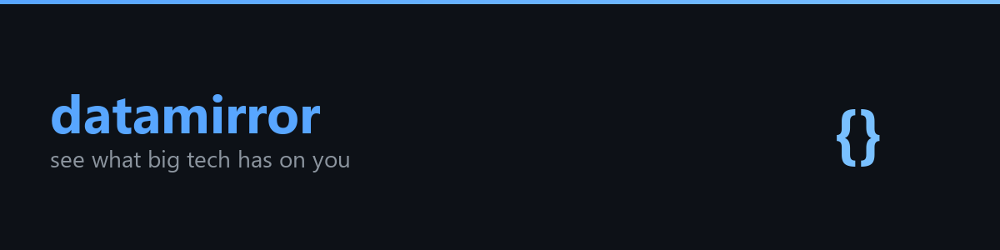
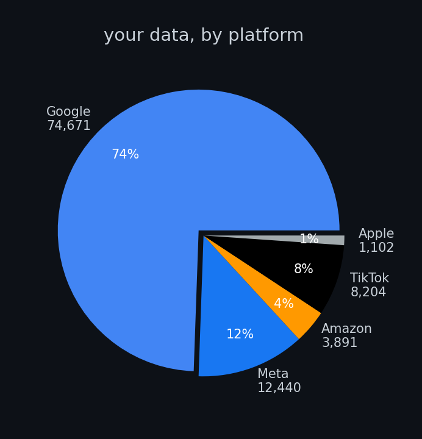
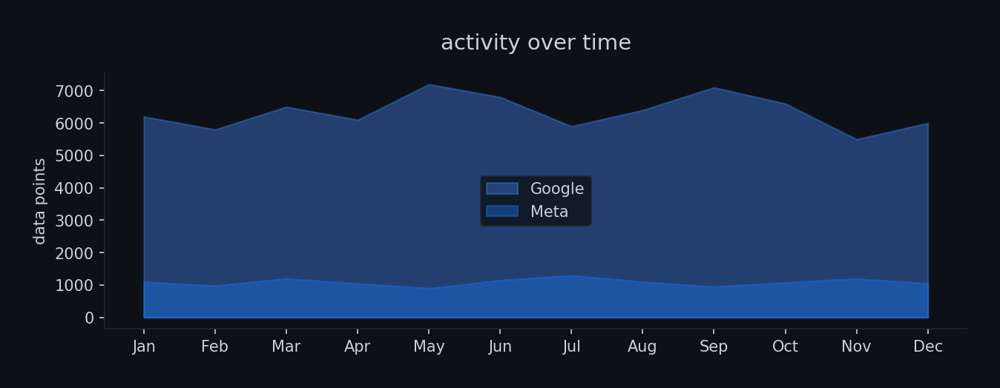

<p align="center">
  
</p>

<p align="center">
  <a href="https://github.com/zandenkane/datamirror/actions/workflows/ci.yml"></a>
  
  
</p>

ever downloaded your Google Takeout and opened it to find 47 nested folders of JSON files that mean absolutely nothing to a human? yeah. this fixes that.

datamirror takes your data exports from Google, Meta, Amazon, Apple, and TikTok, throws them all into one SQLite database, and lets you actually browse what these companies have on you. CLI or web dashboard, your pick. can also generate GDPR/CCPA deletion request letters if you want to tell them to knock it off.

everything stays local. no accounts, no cloud, no irony.

## Features

- **Five platform parsers** for Google Takeout, Meta (Facebook), Amazon order history, Apple privacy export, and TikTok data export
- **Unified SQLite storage** where all events are normalized into one timeline with platform, category, timestamp, and content
- **CLI commands** to import data, query your timeline, search events, view stats, export as JSON/CSV, purge old data, and generate deletion request letters
- **Web dashboard** with a FastAPI + HTMX server rendered UI, filterable timeline, stats overview, and JSON API endpoints
- **No JavaScript build step** since HTMX is vendored as a single file alongside Jinja2 templates and plain CSS


<p align="center">
  
</p>

<p align="center">
  
</p>


## Install

```bash
git clone https://github.com/zandenkane/datamirror.git
cd datamirror
pip install -e .
```

For development (includes pytest and httpx):

```bash
pip install -e ".[dev]"
```

## Quick Start

```bash
# Import a Google Takeout export
datamirror import google ~/takeout/

# See what you imported
datamirror stats

# Browse the 20 most recent events
datamirror timeline

# Search for something specific
datamirror search "coffee shop"

# Start the web dashboard
datamirror serve
```

## Usage

### Import data

Each parser accepts a directory (the unzipped export) or, for some platforms, a single file:

```bash
datamirror import google ~/takeout/
datamirror import meta ~/facebook-export/
datamirror import amazon ~/amazon-data/orders.csv
datamirror import apple ~/apple-privacy/appstore.csv
datamirror import tiktok ~/tiktok-data/user_data.json
```

The Google parser also handles ZIP archives directly:

```bash
datamirror import google ~/takeout-20240315.zip
```

### Browse your timeline

```bash
# Show 20 most recent events
datamirror timeline

# Filter by platform and category
datamirror timeline --platform google --category search --limit 50

# Filter by date range
datamirror timeline --after 2024-01-01 --before 2024-06-01
```

### Search across all data

```bash
# Search titles and bodies for a keyword
datamirror search "python tutorial"

# Narrow to a platform
datamirror search "order" --platform amazon --limit 10
```

### View stats

```bash
datamirror stats
```

Example output:

```
Total events: 1,247

  google:
    Events: 892
    Range:  2023-01-15 to 2024-03-15
    Categories:
      browse: 310
      location: 45
      search: 412
      watch: 125

  amazon:
    Events: 355
    Range:  2022-06-01 to 2024-03-10
    Categories:
      purchase: 340
      search: 15
```

### Export data

```bash
# Export everything as JSON
datamirror export

# Export google search events as CSV
datamirror export --platform google --category search --format csv

# Save to a file
datamirror export --platform amazon --output amazon_purchases.json

# Export a date range
datamirror export --after 2024-01-01 --before 2024-06-01 --output q1_q2.json
```

### View import history

```bash
datamirror history
```

### Delete imported data

```bash
# Remove all google events (with confirmation prompt)
datamirror purge google

# Remove old events without prompting
datamirror purge meta --before 2023-01-01 --yes
```

### Generate a deletion request

```bash
# GDPR deletion request for Google
datamirror delete-request google --name "Your Name"

# CCPA deletion request, saved to a file
datamirror delete-request meta --name "Your Name" --regulation ccpa --output request.txt
```

### Start the web dashboard

```bash
datamirror serve
```

Then open http://localhost:8000 in your browser. The dashboard shows per platform stats on the home page and a filterable timeline with infinite scroll powered by HTMX.

```bash
# Bind to a custom host and port
datamirror serve --host 0.0.0.0 --port 9000
```

### Use a custom database location

By default datamirror stores data in `~/.datamirror/datamirror.db`. Override this for any command:

```bash
datamirror --db ./my-project.db import google ~/takeout/
datamirror --db ./my-project.db timeline
```

## Supported Data

| Platform | Data types parsed |
|----------|-------------------|
| Google   | My Activity (search, web, app), Chrome history, YouTube watch/search history, Location History |
| Meta     | Posts, messages, comments, profile info |
| Amazon   | Order history, search history |
| Apple    | App Store purchases, account activity |
| TikTok   | Video browsing history, likes, comments, favorites, profile info |

## API Endpoints

When running `datamirror serve`, these JSON endpoints are available:

| Endpoint | Description |
|----------|-------------|
| `GET /api/events` | Query events with optional `platform`, `category`, `after`, `before`, `limit`, `offset` params |
| `GET /api/search?q=keyword` | Full text search across titles and bodies |
| `GET /api/stats` | Platform counts, date ranges, and category breakdowns |
| `GET /api/export` | Export all matching events (same filters as `/api/events`, no row limit) |
| `GET /api/history` | Import history log |

## Development

```bash
pip install -e ".[dev]"
pytest -v
```

## License

MIT
